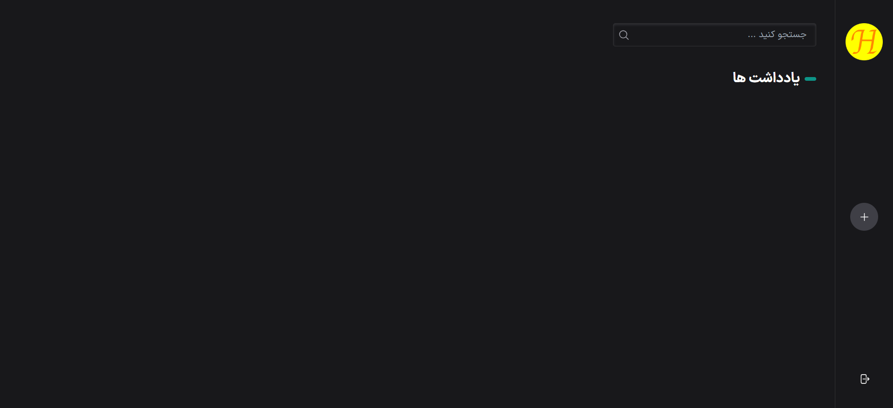
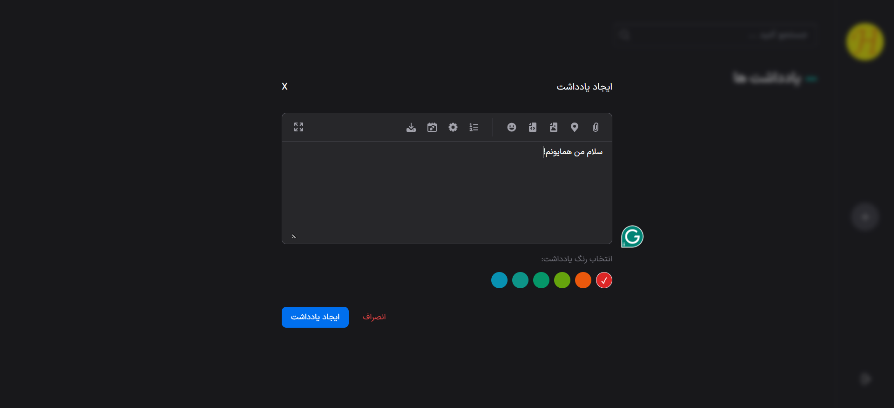
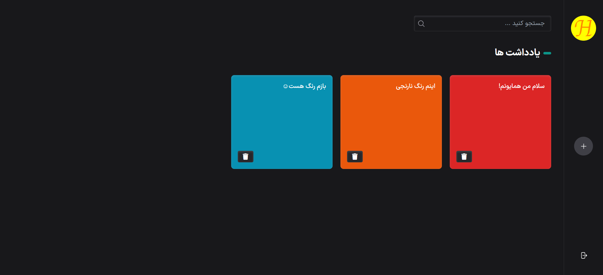
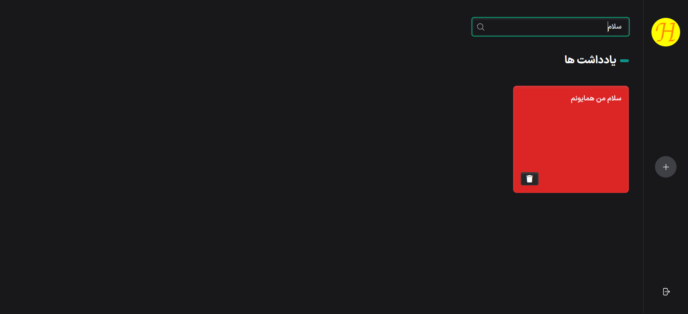

# Homayoun note-app

This is a note app with user-friendly design that I implemented it from js course by [Sabzlearn.ir](https://sabzlearn.ir) website :)

## Screenshots

## Features

- Responsive
- Add/Delete note
- Select arbitrary color for note background
- Search notes
- and more

## How to use

1.  Download or clone the repository
2.  Go to the directory
3.  Open index.html with your browser

## Developer

[Homayoun Naji](https://github.com/Homayoun-Naji)
